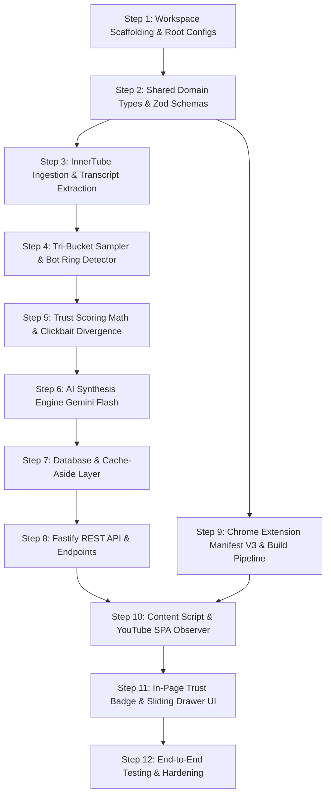

# Implementation Plan: VideoTrust AI (Step-by-Step Execution)

**Goal:** Turn PRD, CLAUDE.md, SPEC-001, and UI/UX Brief into an ordered, dependency-driven engineering blueprint from directory initialization to Chrome Web Store packaging.

---

## User Review Required

> [!IMPORTANT]
> **Execution Order & Dependencies:**
> We will execute strictly in sequence:
> `shared/` (Contracts) $\rightarrow$ `backend/` (Ingestion + Heuristic Filter) $\rightarrow$ `backend/` (Scoring Math + AI) $\rightarrow$ `backend/` (Fastify Server + Cache) $\rightarrow$ `extension/` (Manifest V3 + Observer + UI Drawer).
> 
> **AI Provider Choice:**
> We will configure Google Gemini Flash (`@google/genai` or `@google/generative-ai`) via an environment variable (`GEMINI_API_KEY`). If the key is not set, a local heuristic fallback will generate default summaries for offline development.

---

## Execution Dependency Graph



---

## Step-by-Step Execution Plan

### Step 1: Workspace Scaffolding & Monorepo Setup
- **Goal**: Establish root orchestration, npm workspaces, TypeScript configurations, and linting.
- **Files**:
  - `[NEW]` [package.json](file:///home/yared2124/.gemini/antigravity-ide/scratch/videotrust-ai/package.json) (Defines workspaces: `shared`, `backend`, `extension`).
  - `[NEW]` [tsconfig.base.json](file:///home/yared2124/.gemini/antigravity-ide/scratch/videotrust-ai/tsconfig.base.json) (Strict compiler options).
  - `[NEW]` [.env.example](file:///home/yared2124/.gemini/antigravity-ide/scratch/videotrust-ai/.env.example).
  - `[NEW]` [.gitignore](file:///home/yared2124/.gemini/antigravity-ide/scratch/videotrust-ai/.gitignore).
- **Verification**: `npm run type-check` compiles with zero errors.

---

### Step 2: Shared Contracts & Zod Schemas (`shared/`)
- **Goal**: Define domain entities and runtime validation contracts shared between backend and extension.
- **Files**:
  - `[NEW]` `shared/package.json`
  - `[NEW]` `shared/tsconfig.json`
  - `[NEW]` `shared/src/types/index.ts`:
    - `VideoMetadata`: id, title, channel, views, likes, duration, publishedAt.
    - `RawComment` & `FilteredComment`: id, author, text, likes, isPinned.
    - `TrustScoreBreakdown`: authenticity (30%), sentiment (25%), integrity (25%), engagement (20%).
    - `Verdict`: recommendation (`WATCH` | `MAYBE` | `SKIP`), confidence, trustScore, isClickbait, clickbaitDivergence.
    - `Insights`: summaryShort, keyTakeaways, audienceRedFlags, topAudiencePraise.
    - `AnalysisReport`: full schema unifying all entities.
  - `[NEW]` `shared/src/schemas/index.ts`:
    - Zod schemas validating API requests and responses.
- **Verification**: Unit tests in `shared/tests/schemas.test.ts` validating correct/incorrect payloads.

---

### Step 3: InnerTube Ingestion & Transcript Service (`backend/`)
- **Goal**: Extract metadata, 1,000 comments, and transcripts in $<2.5$s with **0 Google API quota usage**.
- **Files**:
  - `[NEW]` `backend/package.json` (Dependencies: `fastify`, `youtubei.js`, `youtube-transcript`, `zod`).
  - `[NEW]` `backend/src/ingestion/innertube-client.ts`:
    - InnerTube wrapper fetching video details, views, like counts, and channel metadata.
    - Pagination token loop fetching 500–1,000 comments.
  - `[NEW]` `backend/src/ingestion/transcript-fetcher.ts`:
    - Subtitle parser returning timestamped transcript chunks.
    - Graceful fallback setting `transcriptAvailable: false` if captions are disabled.
- **Verification**: Ingestion test fetching 500 comments for a real YouTube video and verifying output structure.

---

### Step 4: Tri-Bucket Sampler & Spam Filter (`backend/`)
- **Goal**: Reduce 1,000 raw comments down to ~120 high-signal comments in $<15$ms.
- **Files**:
  - `[NEW]` `backend/src/filter/bot-detector.ts`:
    - Hash deduplication (detects copy-paste bot rings).
    - Regex filters for WhatsApp scam patterns, crypto promos, and spam links.
    - Emoji density filter (flags comments with $>40\%$ emojis).
  - `[NEW]` `backend/src/filter/tri-bucket.ts`:
    - Slices comments: 40% Top-Upvoted, 40% Recent, 20% Long-Form (>150 chars).
    - Keyword boost for `deprecated`, `broken`, `error`, `outdated`, `scam`, `saved my`.
- **Verification**: Benchmark test measuring reduction from 1,000 comments to 120 comments in $<20$ms.

---

### Step 5: Trust Scoring Engine & Clickbait Divergence (`backend/`)
- **Goal**: Pure mathematical scoring function ($0–100$) and semantic divergence calculation.
- **Files**:
  - `[NEW]` `backend/src/scorer/clickbait-calculator.ts`:
    - Computes lexical/semantic overlap between video title and transcript chunks.
  - `[NEW]` `backend/src/scorer/trust-calculator.ts`:
    - Implements weighted trust formula:
      $$Trust = 0.30 \times Authenticity + 0.25 \times Sentiment + 0.25 \times Integrity + 0.20 \times Engagement$$
    - Pure function: zero side effects, 100% deterministic.
- **Verification**: Unit tests covering 5 test scenarios: high-quality tutorial (score 85+), clickbait (score <40), outdated code (score <60).

---

### Step 6: AI Synthesis Module (`backend/`)
- **Goal**: Use Gemini Flash to generate concise 50-word summaries, 5 bullet takeaways, and audience red flags.
- **Files**:
  - `[NEW]` `backend/src/ai/gemini-client.ts`:
    - Structured prompt requesting strict JSON matching `Insights` schema.
    - Offline fallback generating heuristic takeaways if no API key is present.
- **Verification**: Test generating valid JSON takeaways from sample transcript and comment inputs.

---

### Step 7: Database & Cache-Aside Layer (`backend/`)
- **Goal**: SQLite/PostgreSQL caching layer delivering sub-100ms responses for previously analyzed videos.
- **Files**:
  - `[NEW]` `backend/src/db/schema.ts`: SQLite/Postgres tables (`videos`, `reports`).
  - `[NEW]` `backend/src/db/cache-repository.ts`: Cache-aside read/write implementation with TTL (30 days).
- **Verification**: Integration test proving second request for same video returns in $<50$ms (`X-Cache: HIT`).

---

### Step 8: Fastify REST API Server (`backend/`)
- **Goal**: High-throughput REST API with rate-limiting, CORS, and request validation.
- **Files**:
  - `[NEW]` `backend/src/api/routes/analyze.ts`: Handles `POST /api/v1/analyze`.
  - `[NEW]` `backend/src/api/routes/video.ts`: Handles `GET /api/v1/video/:videoId`.
  - `[NEW]` `backend/src/api/routes/feedback.ts`: Handles `POST /api/v1/feedback`.
  - `[NEW]` `backend/src/server.ts`: Fastify bootstrap, CORS setup, error handler.
- **Verification**: Supertest HTTP suite testing 200, 400 (bad URL), 404 (private video), and 422 (live stream).

---

### Step 9: Chrome Extension Manifest V3 & Build Pipeline (`extension/`)
- **Goal**: Build configuration producing unpacked extension in `extension/dist`.
- **Files**:
  - `[NEW]` `extension/package.json` (Dependencies: `react`, `react-dom`, `lucide-react`, `tailwindcss`, `vite`).
  - `[NEW]` `extension/manifest.json` (Manifest V3 specs, permissions: `storage`, `activeTab`, `*://*.youtube.com/*`).
  - `[NEW]` `extension/vite.config.ts` (Builds content script, service worker, and CSS bundle).
  - `[NEW]` `extension/tailwind.config.js` (Custom tokens: Obsidian glass, emerald, amber, rose).
- **Verification**: `npm run build:extension` generates clean `extension/dist` folder with zero errors.

---

### Step 10: Content Script & YouTube SPA Observer (`extension/`)
- **Goal**: Detect YouTube video navigation without full page reloads.
- **Files**:
  - `[NEW]` `extension/src/content/observer.ts`:
    - Listens to `yt-navigate-finish` and DOM mutations on `#above-the-fold`.
    - Handles debounced injection and cleanup on route change.
  - `[NEW]` `extension/src/background/service-worker.ts`:
    - Proxies network requests to backend API, avoiding CORS issues.
- **Verification**: Loading extension on YouTube injects placeholder badge when navigating between videos.

---

### Step 11: In-Page Pill Badge & Sliding Drawer UI (`extension/`)
- **Goal**: Implement the complete design from the UI/UX brief.
- **Files**:
  - `[NEW]` `extension/src/ui/TrustBadge.tsx`:
    - Pill badge with loading shimmer, status dot (🟢/🟡/🔴), score, and hover glow.
  - `[NEW]` `extension/src/ui/RadialGauge.tsx`:
    - Circular SVG meter ($72$px) displaying trust score.
  - `[NEW]` `extension/src/ui/SlidingDrawer.tsx`:
    - 420px glassmorphism slide-over drawer with 3 tabs (`Overview`, `Audience Truth`, `Metrics`).
  - `[NEW]` `extension/src/ui/RedFlagCard.tsx`:
    - Alert-styled cards highlighting audience warnings.
- **Verification**: Visual inspection on YouTube ensuring zero layout shifts (CLS = 0) and smooth `Esc` dismiss.

---

### Step 12: Production Hardening, Security & Packaging
- **Goal**: Security audit, sanitization, Docker containerization, and store readiness.
- **Files**:
  - `[NEW]` `Dockerfile` (Multi-stage build for backend API).
  - `[NEW]` `docker-compose.yml` (Backend + Redis).
  - `[NEW]` `.github/workflows/ci.yml` (Lint, test, typecheck automation).
- **Verification**: Full test suite pass + extension `.zip` generated for Chrome Web Store.

---

## Verification Plan

### Automated Tests
```bash
# 1. Type check across all workspaces
npm run type-check

# 2. Run unit tests for scoring math and spam detection
npm run test:unit

# 3. Run integration tests for API endpoints
npm run test:integration
```

### Manual Verification Checklist
1. **InnerTube Quota Check**: Scrape 1,000 comments and verify 0 units consumed on Google Cloud Console.
2. **Badge Injection**: Load unpacked extension in Chrome, browse YouTube, verify badge appears beside subscribe button in $<2$ seconds.
3. **Drawer Interactions**: Click badge, verify smooth slide-in, tab switching, and `Esc` key closing.
4. **Caching Verification**: Revisit same video, verify instant badge load in $<100$ms (`X-Cache: HIT`).
