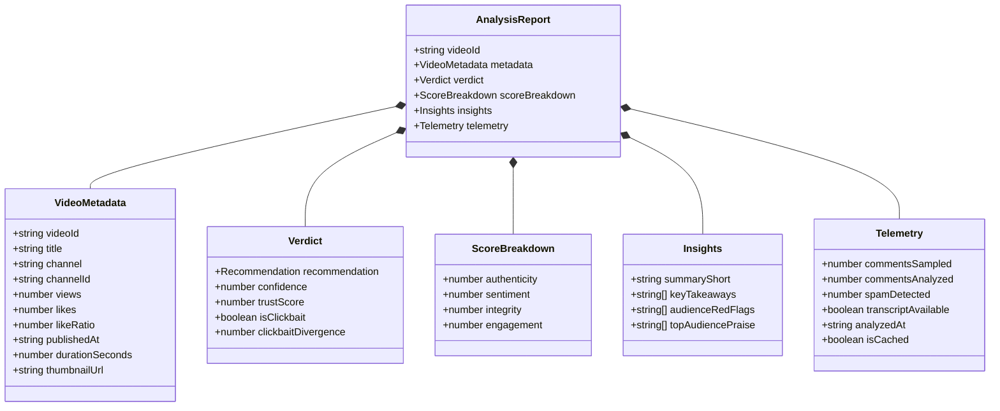

# SPEC-001: Video Analysis & In-Page Trust Verification Engine

**Status:** APPROVED FOR IMPLEMENTATION  
**Author:** VideoTrust AI Core Engineering  
**Version:** 1.0.0  
**Target Milestone:** Phase 0 & Phase 1  
**Approach:** Spec-Driven Development (SDD)  

---

## 1. Feature Overview & Scope

### 1.1 Objective
Provide an end-to-end specification for analyzing any public YouTube video given its URL or ID. The system extracts metadata, transcript segments, and up to 1,000 comments via InnerTube without consuming Google API quotas, filters spam/bot rings, detects clickbait divergence, and returns a verified `AnalysisReport` rendered in an in-page Chrome Extension badge and sliding drawer.

### 1.2 User Story
> *As a software developer or student watching a YouTube tutorial, I want to see an instant in-page Trust Score and Audience Red-Flag summary so that I can determine if the video is high-quality and technically up-to-date before wasting 45 minutes.*

---

## 2. API Endpoints Specification

### 2.1 `POST /api/v1/analyze`
Initiates an analysis of a YouTube video or returns an existing cached report.

- **URL:** `/api/v1/analyze`
- **Method:** `POST`
- **Content-Type:** `application/json`
- **Rate Limit:** 30 requests / minute per client IP

#### 2.1.1 Request Payload
```json
{
  "url": "https://www.youtube.com/watch?v=dQw4w9WgXcQ",
  "forceRefresh": false
}
```
*Note: Clients can pass either `"url"` (full YouTube URL) or `"videoId"` (11-character string).*

#### 2.1.2 Response Headers
- `X-Cache: HIT | MISS` (indicates whether served from cache or scraped live)
- `X-Execution-Time-Ms: <integer>` (latency in milliseconds)

#### 2.1.3 Success Response (`200 OK`)
```json
{
  "success": true,
  "data": {
    "videoId": "dQw4w9WgXcQ",
    "metadata": {
      "title": "Build a Full-Stack App in 10 Minutes with Docker & Node.js",
      "channel": "TechSprint",
      "channelId": "UC1234567890",
      "views": 320000,
      "likes": 12500,
      "likeRatio": 0.039,
      "publishedAt": "2024-03-15T12:00:00Z",
      "durationSeconds": 634,
      "thumbnailUrl": "https://i.ytimg.com/vi/dQw4w9WgXcQ/hqdefault.jpg"
    },
    "verdict": {
      "recommendation": "MAYBE",
      "confidence": 0.88,
      "trustScore": 62,
      "isClickbait": true,
      "clickbaitDivergence": 0.71
    },
    "scoreBreakdown": {
      "authenticity": 48,
      "sentiment": 65,
      "integrity": 40,
      "engagement": 82
    },
    "insights": {
      "summaryShort": "Fast-paced overview of Docker basics, but lacks actual full-stack implementation details.",
      "keyTakeaways": [
        "Covers basic Dockerfile instructions for Node.js",
        "Demonstrates docker run port mapping",
        "Promotes a paid backend course at minute 7:30"
      ],
      "audienceRedFlags": [
        "⚠️ 18 users report syntax breaks in Node.js v20+",
        "⚠️ Code repository link in description is a 404 dead link",
        "⚠️ 35% of positive comments show bot-ring copy-paste patterns"
      ],
      "topAudiencePraise": [
        "Clear visual diagram of Docker bridge networking"
      ]
    },
    "telemetry": {
      "commentsSampled": 850,
      "commentsAnalyzed": 120,
      "spamDetected": 142,
      "transcriptAvailable": true,
      "analyzedAt": "2026-09-16T04:45:00Z",
      "isCached": false
    }
  }
}
```

#### 2.1.4 Error Responses
- **`400 Bad Request`**: Invalid or missing YouTube URL/ID.
  ```json
  {
    "success": false,
    "error": { "code": "INVALID_YOUTUBE_ID", "message": "Could not parse valid 11-character video ID from URL." }
  }
  ```
- **`404 Not Found`**: Video does not exist or is private/deleted.
  ```json
  {
    "success": false,
    "error": { "code": "VIDEO_NOT_FOUND", "message": "The requested video is private, deleted, or inaccessible." }
  }
  ```
- **`422 Unprocessable Entity`**: Video is a live stream or comments are disabled.
  ```json
  {
    "success": false,
    "error": { "code": "LIVE_STREAM_UNSUPPORTED", "message": "Live streams cannot be analyzed until broadcast ends." }
  }
  ```

---

### 2.2 `GET /api/v1/video/:videoId`
Fast-path lookup to query if an analysis already exists in the community cache.

- **URL:** `/api/v1/video/:videoId`
- **Method:** `GET`
- **Success (`200 OK`):** Returns the cached `AnalysisReport` (latency $<50$ms).
- **Not Found (`404`):** `{ "success": false, "error": { "code": "NOT_CACHED" } }`.

---

## 3. Data Models (Domain Entities)



---

## 4. UI/UX Specification (Chrome Extension)

### 4.1 In-Page Trust Badge (Content Script Injection)
- **DOM Insertion Point**: Injected into YouTube's DOM directly adjacent to `#owner` / subscribe container below the video player.
- **Dimensions**: Height $36$px, auto width ($120$px–$160$px), rounded pill (`border-radius: 9999px`).
- **States**:
  - **Loading Skeleton**: Shimmering pulsing pill: *"Analyzing Trust..."*
  - **🟢 High Trust (80–100)**: `#10B981` (Emerald), text: *"88% Trust • Recommended"*.
  - **🟡 Caution (55–79)**: `#F59E0B` (Amber), text: *"62% Trust • Check Warnings"*.
  - **🔴 Low Trust (0–54)**: `#EF4444` (Crimson), text: *"34% Trust • Clickbait/Outdated"*.
- **Click Event**: Triggers smooth right-to-left slide animation opening the analysis drawer.

### 4.2 Sliding Analysis Drawer
- **Position**: Fixed overlay anchored to the right edge (`top: 0, right: 0, height: 100vh, width: 420px`).
- **Z-Index**: `999999` (above YouTube header and video theater mode).
- **Structure**:
  1. **Header Bar**: Video title, close button (`Esc` shortcut enabled), Watch/Skip banner.
  2. **Score Metric Gauge**: Circular 0–100 progress ring with color matching trust state.
  3. **Tabbed Content Navigation**:
     - **Tab 1: Summary & Takeaways** (50-word TL;DR, 5 bullet points).
     - **Tab 2: Audience Red Flags** (List of user warnings highlighted with yellow/red alert borders).
     - **Tab 3: Score Breakdown** (Horizontal progress bars for Authenticity, Sentiment, Integrity, Engagement).
  4. **Feedback Footer**: *"Was this helpful? [Agree 👍] [Disagree 👎]"*.

---

## 5. Input Validation Rules (Zod Schemas)

### 5.1 YouTube ID Extraction Regex
Validates standard watch URLs, short URLs, and embed URLs:
```typescript
const YOUTUBE_URL_REGEX = 
  /^(?:https?:\/\/)?(?:www\.|m\.)?(?:youtube\.com\/(?:watch\?(?:.*&)?v=|embed\/|v\/|shorts\/)|youtu\.be\/)([a-zA-Z0-9_-]{11})(?:[?&].*)?$/;
```

### 5.2 Zod Contract Schema
```typescript
import { z } from "zod";

export const VideoIdSchema = z.string().regex(/^[a-zA-Z0-9_-]{11}$/, "Invalid 11-char YouTube ID");

export const AnalyzeRequestSchema = z.object({
  url: z.string().url().optional(),
  videoId: VideoIdSchema.optional(),
  forceRefresh: z.boolean().default(false),
}).refine(data => data.url || data.videoId, {
  message: "Either url or videoId must be provided."
});

export const RecommendationEnum = z.enum(["WATCH", "MAYBE", "SKIP"]);

export const ScoreBreakdownSchema = z.object({
  authenticity: z.number().min(0).max(100),
  sentiment: z.number().min(0).max(100),
  integrity: z.number().min(0).max(100),
  engagement: z.number().min(0).max(100),
});

export const VerdictSchema = z.object({
  recommendation: RecommendationEnum,
  confidence: z.number().min(0).max(1),
  trustScore: z.number().min(0).max(100),
  isClickbait: z.boolean(),
  clickbaitDivergence: z.number().min(0).max(1),
});
```

---

## 6. Edge Cases & Resilience Matrix

| Scenario | System Behavior | User Experience |
| :--- | :--- | :--- |
| **Comments Disabled** | Ingestion flags `commentsDisabled: true`. Skips spam & sentiment stages. Score derived from metadata & transcript. | Badge displays yellow warning: *"Comments Disabled by Creator"*. |
| **No Transcript / CC Disabled** | Ingestion flags `transcriptAvailable: false`. Divergence set to `0`. Score derived from Tri-Bucket comment signals. | Analysis shows: *"Audience-Verified (Captions unavailable)"*. |
| **Live Stream in Progress** | Ingestion detects `isLive: true`. Fails early with HTTP 422. | Badge displays: *"Live Stream (Available after broadcast)"*. |
| **Brand New Video (<1 hr, 0 comments)** | Metadata ingested, comment count $= 0$. Score marked with low confidence ($<0.4$). | Badge shows neutral state: *"Pending Crowd Data"*. |
| **SPA Route Change (User clicks next video)** | Content script listens to `yt-navigate-finish`. Removes old badge, resets state, launches new query. | Badge smoothly updates in $<100$ms if next video is cached. |
| **API Timeout / Network Down** | Extension handles network error with graceful fallback badge. | Pill badge displays: *"VideoTrust Offline [Retry]"*. |
